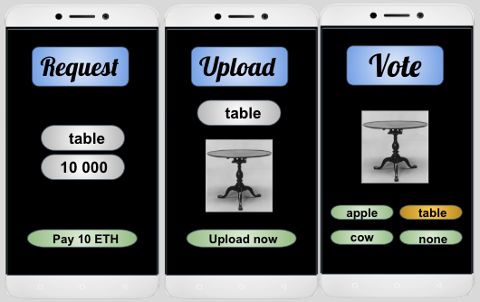

# BETHabase
### A distributed Marketplace for special image acquisition

The aim of our project is to provide a solution to the problem of database collection by using blockchain. Users are given the chance to upload images and verify the integrity of the accumulated data in exchange for reputation tokens and ethereum.

### Current Difficulties
#### Verifying datasets based on human input  
* Creating Databases is costly both money and time wise: Until now no incentivation mechanism for the broad masses participating in image collection  
* Information is hard to verify: Only big cooperation are eligible of acquiring verified datasets limiting democratisation of technological growth
* Feeding Deep Learning Algorithms: Finding big datasets of pictures for supervised learning algorithms are hard to acquire and end up being put together by Universities. How would you get 2000 pictures of hand images in front of an ATM machine?

### A Decentralized Solution For The Information Exchange
#### Acquisition of verified data through social consensus 

* Democratization: Empower the free-flow of verified data, giving small research institutions the access to affordable datasets.
* Gamification: The reputation token system enables a social gamification. of any kind of task. 
Rank up and ladder up the ranking system of good behaviour
* Incentivizing honest collaboration

### Three Step Solution for Data Verification Using the Social Consesus
#### Client
The client sends a request by specifying the tag to which a dataset should be collected and the amount of images that is needed. The request along with the upfront payment is submitted to the blockchain. In the example below, a user requests 1000 images of an apple and 100 images of a house.
#### Uploader
The Uploaders see various tags currently being requested. An image can be uploaded to any of the given tags. In the example below, the uploader is right next to an apple and takes a picture of the apple uploading its IPFS hash to the blockchain. The IPFS integration is yet to be implemented.
#### Voters (Social Consensus)
A voter can simply look at the current avaialable images and vote as to what he/she believes the answer is. Giving the social consesus a choice between multiple answers, where one answer is the original tag to which the photo was uploaded allows to elegantly solve the verification problem by matching tags. If the majority vote on the tag to which the image was uploaded, the image gets accepted and all parties involved (both voters and uploader) receive payment in means of ethereum and reputation tokens. If an image receives more votes on tags other than what it was intended for it gets discarded. A reputation decrease takes place for all parties.

### Incentivizing Honest Collaboration while Enabling Gamification
Honest collaboration is expected since the Uploader and the Voters must pay the gas prices for the transactions they call. Sine they earn back their investment (and much more) only when the deed is complete they are incentivized to play the game as intended. We introduce a reputation token to further incentivize honest collaboration. Each correct vote and upload earns a reputation token. Each wrong vote reduces the amount by one down to zero. (not yet implemented): With a reputation list online users can compete with each other for the top seats. Some ethereum always remains in the smart contract. An example case to illustrate this would be there being a single uploader and two confirmers. If we require a majority from 3, then these three parties can locally approve an image. A single image is currently set at 10^12 wei. Dividing that by 3 has 1 wei remaining. In a working system, this ethereum will get collected with time, and in certain periods will be donated to those who are on top of the reputation list.
### Demo
We provide a possible user interface with a demo of the current frontend connected to the backend. 

<b/>
*Disclaimer: This project was built for the BETH Hackathon in just 2 days. Use in caution.* 
